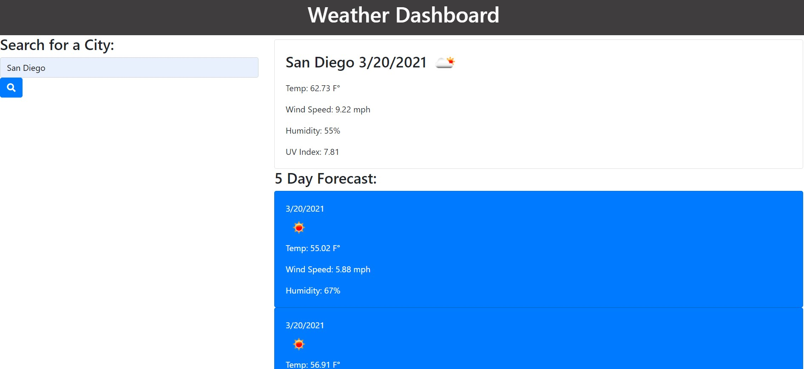

# Weather Dashboard
A simple weather app built using [Open Weather API](https://openweathermap.org/)

  
  
  
  
  

# Description
The purpose of this project was to build a simple weather app that would be able to search for weather by city, display the current weather and a 5 day forecast, and save searches to local storage so returning users can quickly search previous cities.  

## Deployment
Click the link [here](https://dillonhoban.github.io/Weather_Dashboard/) to check out my site in your browser.

## Acknowledgments
A special thank you to [Christina](https://github.com/Christina2021), [Ravi](https://github.com/ravifindravicom), [Brian](https://github.com/btparker70), [Anastasia](https://github.com/anaiva27) and [Emily](https://github.com/ethomas22). Without you fine folks the study group would not be as awesome!

## Validation 
This site’s HTML was validated using a third party service found [here.](https://validator.w3.org/)

## License
[MIT](https://choosealicense.com/licenses/mit/)